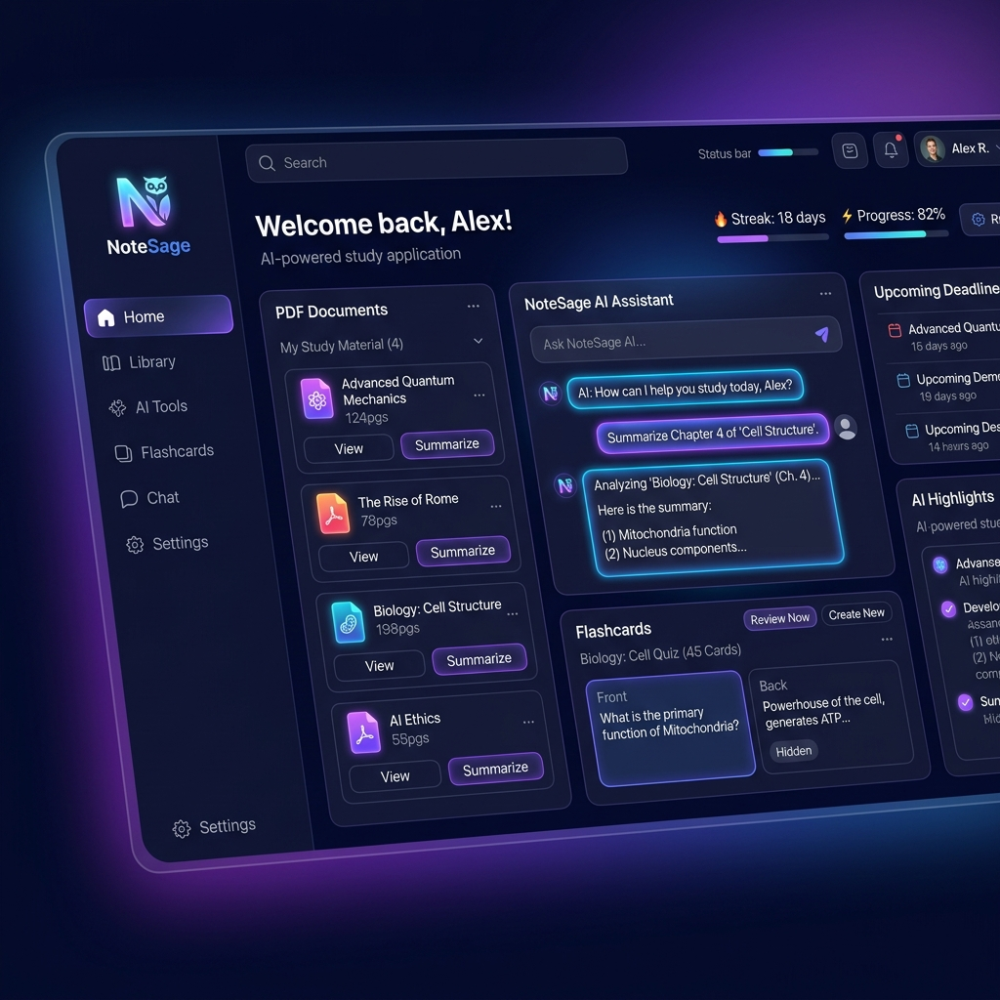
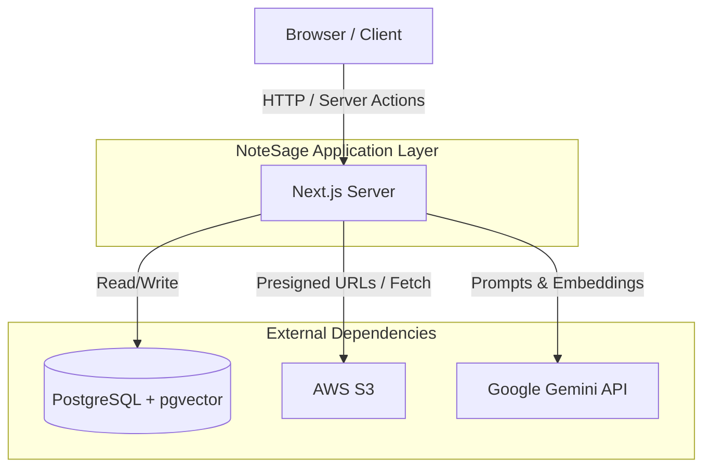
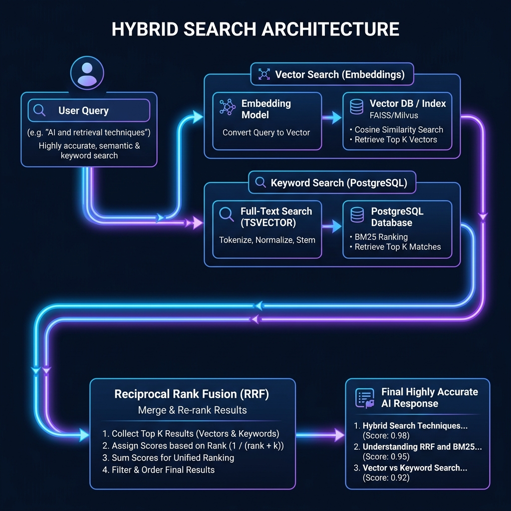
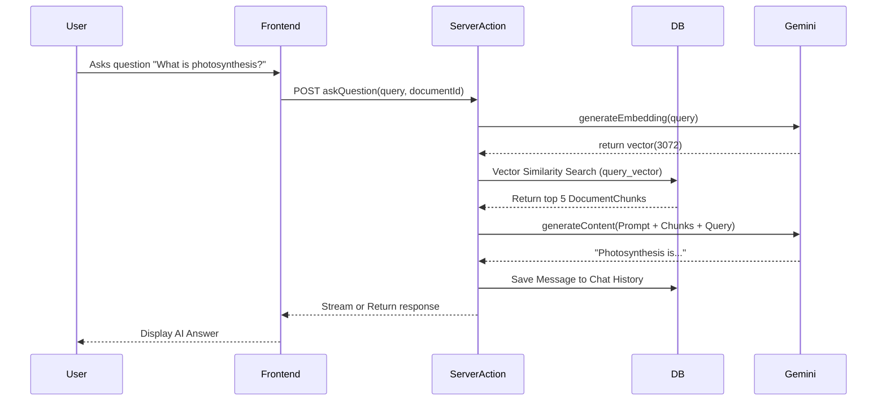

<div align="center">
  
  <h1>NoteSage</h1>
  <p><strong>An advanced AI-powered study platform featuring Retrieval-Augmented Generation (RAG) and Hybrid Search.</strong></p>
</div>

---

## 📖 Project Introduction

Modern students and lifelong learners are overwhelmed by static materials (PDFs, lectures, notes). NoteSage solves the problem of passive consumption by turning static documents into active, engaging learning tools. Instead of just reading a textbook chapter, users can converse with it, test themselves on it, and schedule study sessions around it.

## ✨ Core Features

* **Document Chat (RAG):** Securely upload PDFs directly to AWS S3. NoteSage chunks, embeds, and vectorizes your documents so you can ask natural language questions and receive highly accurate AI answers sourced directly from your textbook.
* **Intelligent Flashcards:** Automatically generate spaced-repetition flashcards from your documents, ensuring long-term memory retention.
* **AI Quiz Generation:** Prompt-engineered generation of strict JSON-based multiple-choice quizzes to test your knowledge on specific chapters.
* **Automated Study Planner:** Calculates reading velocity and automatically schedules document chapters based on your target exam date.
* **User Profile & Settings:** Customizable UI (Dark/Light mode, Accent colors) and notification preferences.

---

## 📖 How to Use NoteSage

### 1. Uploading Documents
* Navigate to the **Documents** section via the sidebar.
* Click the **Upload Document** button and select a PDF.
* *Note: The document will go into a "Processing" state while the AI extracts text, generates vector embeddings, and stores them. Wait until it completes before chatting.*

### 2. Document Chat (RAG)
* Navigate to the **Study Chat** section.
* Use the dropdown menu in the top-right corner to select the document you want to chat with.
* Ask any question! The AI will search the document and generate an answer based **only** on the uploaded textbook/notes.

### 3. Generating Flashcards
* Navigate to the **Flashcards** section.
* In the top-right corner, select an unstudied document from the dropdown.
* Click the **AI Generate Deck** button (the sparkly wand icon).
* The AI will automatically extract the most important concepts and create active-recall flashcards.
* Click **Study** on the generated deck to flip through cards and rate your mastery (Got it vs Need Practice).

### 4. Taking AI Quizzes
* Navigate to the **Quizzes** section.
* Click **Generate Quiz** and select the documents you want to be tested on.
* Choose your desired difficulty (Easy, Medium, Hard) and the number of questions.
* Take the multiple-choice test and receive immediate grading!

---

## 🏛 Architecture Documentation

### System Overview
NoteSage operates as a monolithic Next.js application utilizing the App Router. The client interacts heavily with Server Actions for data mutations and data fetching. Heavy lifting (like processing PDFs and generating embeddings) is orchestrated by the Next.js backend, communicating with external services (Gemini, S3) and persisting to a PostgreSQL database powered by Prisma.

### High-Level Architecture Diagram


---

## 🧠 Deep Dive: Hybrid Search Architecture

NoteSage does not rely on standard Vector Search. To guarantee absolute precision—especially when searching for specific acronyms, ID numbers, or names—NoteSage implements **Hybrid Search with Reciprocal Rank Fusion (RRF)** directly inside PostgreSQL.

<div align="center">
  
</div>

### How it works:
1. **Vector Search (`pgvector`):** The user's query is converted into a 3072-dimensional vector using the Gemini API. We calculate the mathematical *cosine distance* against all document chunks to find paragraphs with the exact same **meaning** or semantic intent.
2. **Keyword Search (`to_tsvector`):** Simultaneously, we run a traditional PostgreSQL Full-Text Search to find exact **keyword** matches in the text.
3. **Reciprocal Rank Fusion (RRF):** We merge both lists together using the RRF mathematical formula `(1.0 / (60 + rank))`. This ensures that a text chunk containing both high semantic meaning AND the exact keywords floats to the absolute top of the results.

The resulting top 5 chunks are injected into a secure system prompt, and the Gemini 1.5 model streams the final answer back to the React UI using Server Actions.

### Request Lifecycle (RAG Chat Example)


---

## Detailed User Workflows

### Authentication Flow


### PDF Upload Flow


---

## 🛠 Technology Stack

### Frontend
- **Next.js 16 (App Router):** Chosen for Server Components, high performance, and simplified routing.
- **React 19:** Utilizes the latest concurrent features and hooks.
- **Tailwind CSS v4 & Base UI:** Chosen for rapid, utility-first styling with unstyled, accessible component primitives. 
- **Lucide React:** Clean, consistent iconography.

### Backend
- **Next.js Server Actions:** Eliminates the need for separate API routes, providing end-to-end type safety between client components and backend mutations.
- **Better Auth:** A modern, flexible authentication library. Chosen for its strict TypeScript support and ease of integration with Prisma.

### Database
- **PostgreSQL:** Reliable, ACID-compliant relational database.
- **Prisma ORM:** Chosen for incredible developer experience and type safety.
- **pgvector:** PostgreSQL extension enabling high-dimensional vector similarity search directly in the primary database.

### AI Layer
- **Google Gemini API (`@google/genai`):** Used for advanced reasoning and response generation.
- **Langchain (`@langchain/community` / `textsplitters`):** Manages the chunking of PDFs and coordination of LLM chains.
- **gemini-embedding-001:** Generates 3072-dimensional vector embeddings for text chunks.

### Storage
- **AWS S3:** Scalable, durable object storage for uploaded PDFs. We use pre-signed URLs to keep uploads secure and offload bandwidth from the Next.js server.


---

## 🚀 Local Development Setup

Because the project is nested, you must navigate into the correct directory first.

1. **Clone and navigate:**
   ```bash
   git clone https://github.com/Shubhamkr585/NoteSage.git
   cd NoteSage/notesage/notesage
   ```

2. **Configure Environment Variables:**
   Create a `.env` file based on `.env.example`. You will need AWS S3 Credentials, a Google Gemini API Key, and Google OAuth credentials.

3. **Deploy via Docker:**
   ```bash
   docker compose build --no-cache
   docker compose up -d
   ```

4. **Initialize Database:**
   ```bash
   docker compose exec app npx prisma db push
   ```

5. **Access the Application:**
   Open `http://localhost` in your browser.

---

## ☁️ Deployment Guide

### Development
For local testing, use Docker for Postgres + pgvector, and run `npm run dev`. S3 can be mocked via LocalStack or by using a dedicated dev AWS bucket.

### Staging / Production
1. **Frontend / Node Server:** Deploy the Next.js application to **Vercel** or **Railway**.
2. **Database:** Deploy PostgreSQL to a provider that supports `pgvector` natively (e.g., Supabase, Neon, AWS RDS).
3. **Storage:** Ensure S3 bucket CORS is configured to allow PUT requests from your production domain (for pre-signed URLs).
4. **CI/CD:** Use GitHub Actions to run `npm run lint`, `tsc --noEmit`, and `npx prisma generate` before allowing merges to the `main` branch.

---

## 🔮 Future Enhancements

- **Short-term:** Granular analytics tracking quiz scores over time. Support for .docx and .pptx uploads.
- **Medium-term:** Collaborative study groups allowing users to share flashcard decks and quiz challenges.
- **Long-term:** Voice Tutor interface for conversational learning on mobile devices.
