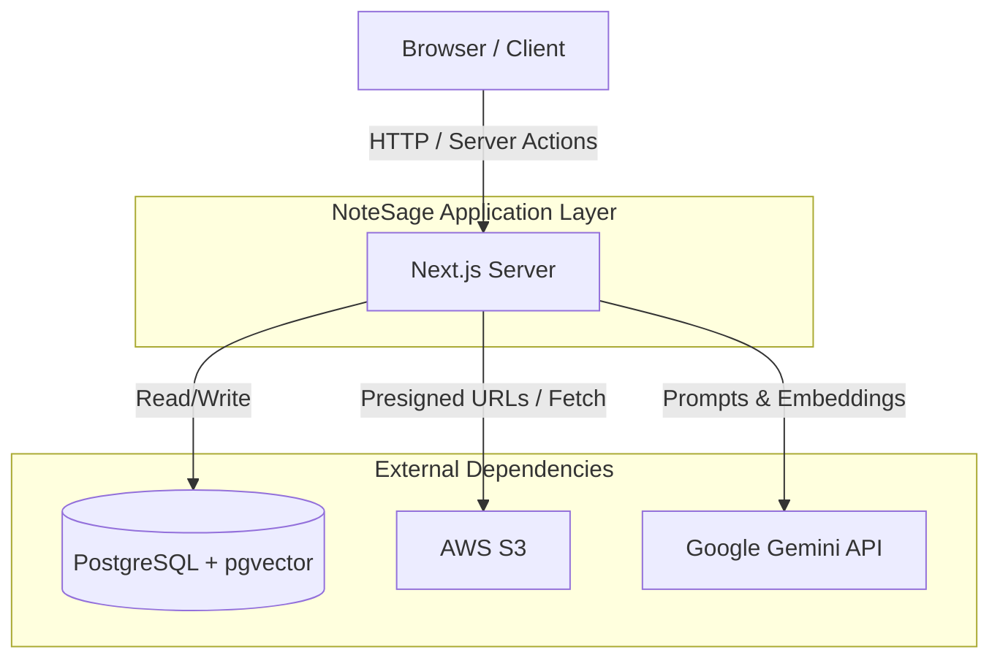
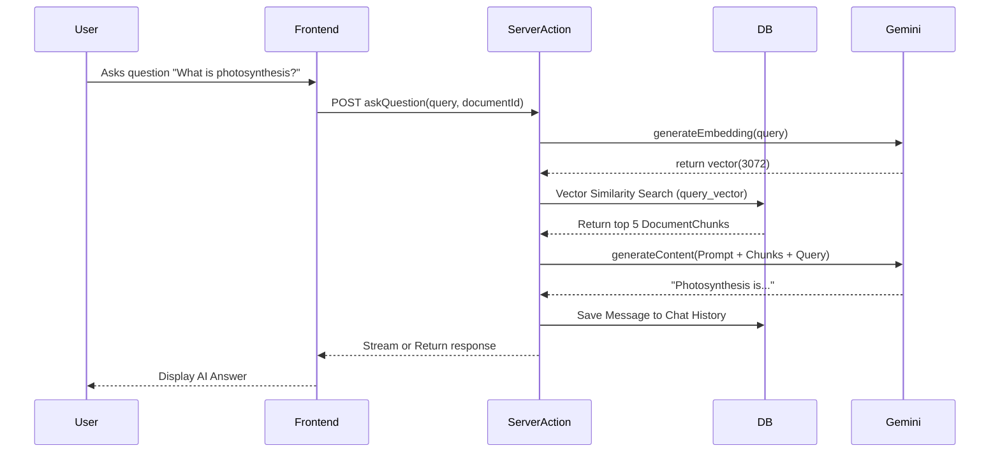
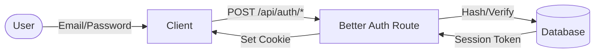
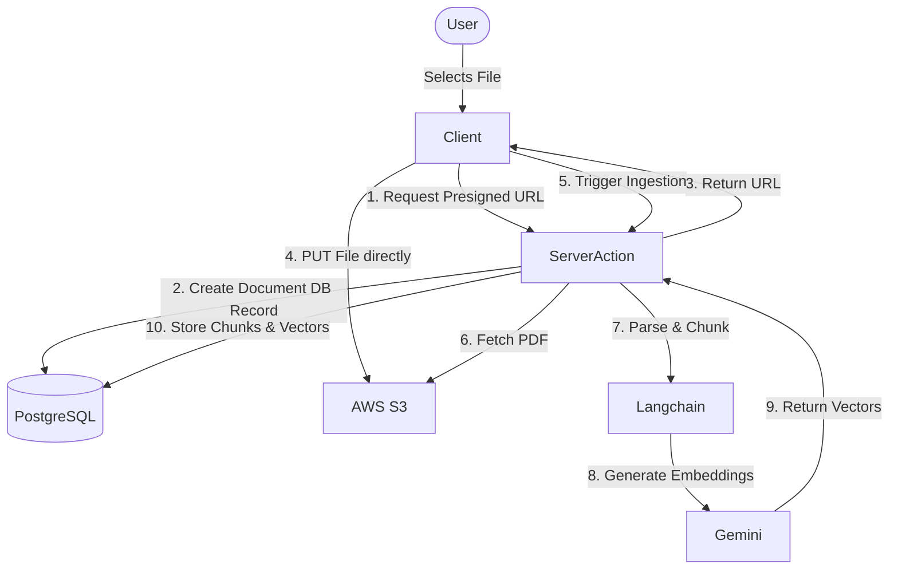
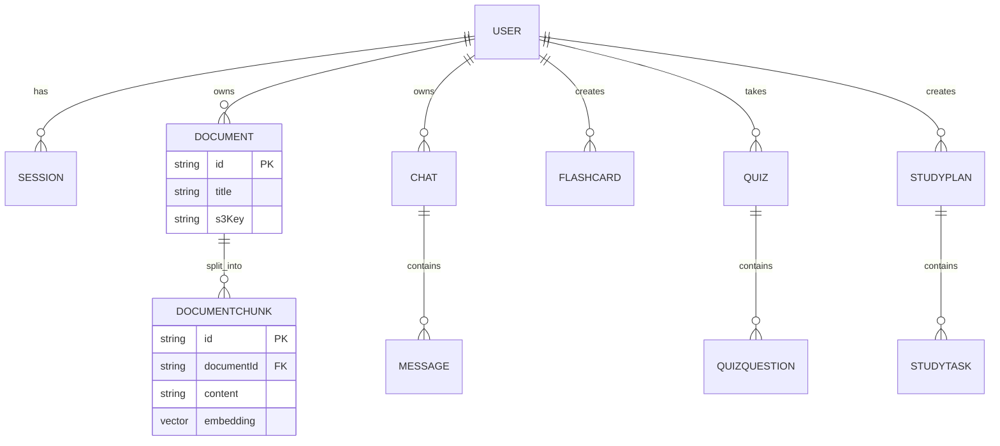

# NoteSage

An AI-powered learning workspace that transforms study materials into an interactive learning experience.

---

## 📖 Project Introduction

### What problem NoteSage solves
Modern students and lifelong learners are overwhelmed by static materials (PDFs, lectures, notes). NoteSage solves the problem of passive consumption by turning static documents into active, engaging learning tools. Instead of just reading a textbook chapter, users can converse with it, test themselves on it, and schedule study sessions around it.

### Why it exists
NoteSage exists to bridge the gap between information availability and actual knowledge retention. It leverages modern Generative AI to provide a personalized, 24/7 AI tutor that has direct context of the user's specific coursework and learning materials.

### Who it is built for
- **University Students** managing heavy reading loads.
- **Self-taught Professionals** upskilling with whitepapers and documentation.
- **Educators** looking for a tool to easily generate quizzes and flashcards from their syllabi.

### Key benefits
- **Context-Aware Assistance:** Chat directly with your documents. The AI only uses your provided context to avoid hallucinations.
- **Active Recall Engine:** Automatically generated flashcards and quizzes improve memory retention.
- **Structured Learning:** Study planners ensure that learning is paced and organized leading up to exam dates.

---

## ✨ Features

- **User Authentication:** Secure, session-based authentication supporting email/password. *(Note: OAuth providers are not yet implemented).*
- **PDF Upload & Management:** Securely upload, store, and manage study materials (PDFs and Text).
- **Doc Chat (RAG):** An interactive chat interface that answers questions by retrieving precise context from uploaded documents using vector search.
- **Flashcard Generation:** Automatically extract key concepts from documents and turn them into spaced-repetition flashcards.
- **Quiz Generation:** Generate Multiple Choice, True/False, and Short Answer questions based on document context.
- **Study Planner:** Create study plans with structured tasks leading up to exam dates.
- **User Profile & Settings:** Customizable UI (Dark/Light mode, Accent colors) and notification preferences.

---

## 🔄 Product Workflow

1. **Registration:** User creates an account and sets their profile preferences.
2. **Upload PDF:** User uploads a textbook or lecture notes. The system processes, chunks, and embeds the text.
3. **AI Chat:** User asks questions like *"Explain the core concept in chapter 3"*. The system retrieves relevant chunks and answers.
4. **Flashcards:** User generates flashcards for the document to practice active recall.
5. **Quizzes:** User generates a quiz to test their knowledge and track their score.
6. **Study Plan:** User inputs an exam date, and the system scaffolds study tasks leading up to the deadline.

---

## 🛠 Technology Stack

### Frontend
- **Next.js 16 (App Router):** Chosen for Server Components, high performance, and simplified routing.
- **React 19:** Utilizes the latest concurrent features and hooks.
- **Tailwind CSS v4 & Base UI:** Chosen for rapid, utility-first styling with unstyled, accessible component primitives. 
- **Lucide React:** Clean, consistent iconography.

### Backend
- **Next.js Server Actions:** Eliminates the need for separate API routes, providing end-to-end type safety between client components and backend mutations.
- **Better Auth:** A modern, flexible authentication library. Chosen for its strict TypeScript support and ease of integration with Prisma.

### Database
- **PostgreSQL:** Reliable, ACID-compliant relational database.
- **Prisma ORM:** Chosen for incredible developer experience and type safety.
- **pgvector:** PostgreSQL extension enabling high-dimensional vector similarity search directly in the primary database.

### AI Layer
- **Google Gemini API (`@google/genai`):** Used for advanced reasoning and response generation.
- **Langchain (`@langchain/community` / `textsplitters`):** Manages the chunking of PDFs and coordination of LLM chains.
- **gemini-embedding-001:** Generates 3072-dimensional vector embeddings for text chunks.

### Storage
- **AWS S3:** Scalable, durable object storage for uploaded PDFs. We use pre-signed URLs to keep uploads secure and offload bandwidth from the Next.js server.

---

## 📁 Project Structure

```text
notesage/
├── prisma/
│   └── schema.prisma         # Database schema and models
├── public/                   # Static assets
├── src/
│   ├── app/                  # Next.js App Router pages and layouts
│   │   ├── (auth)/           # Authentication pages (login, register)
│   │   ├── (dashboard)/      # Protected application routes
│   │   └── api/              # API endpoints (e.g., auth, webhooks)
│   ├── components/
│   │   ├── features/         # Feature-specific components (chat, quizzes)
│   │   ├── layout/           # Global layout components (Sidebar, Topbar)
│   │   └── ui/               # Reusable presentational components
│   ├── lib/                  # Shared utilities (db, auth, constants)
│   └── server/
│       ├── actions/          # Next.js Server Actions (mutations)
│       └── services/         # Core business logic (RAG, Embeddings, S3)
├── .env                      # Environment variables
├── next.config.ts            # Next.js configuration
├── package.json              # Project dependencies
└── tailwind.config.ts        # Tailwind styling tokens
```

---

## 🚀 Local Development Setup

1. **Clone the repository:**
   ```bash
   git clone https://github.com/your-org/notesage.git
   cd notesage
   ```

2. **Install Dependencies:**
   ```bash
   npm install
   ```

3. **Set up Environment Variables:**
   Create a `.env` file in the root directory and add the required variables (see below).

4. **Database Setup:**
   Ensure you have a PostgreSQL instance running with the `pgvector` extension installed.
   ```bash
   npx prisma db push
   npx prisma generate
   ```

5. **Start the Development Server:**
   ```bash
   npm run dev
   ```

---

## 🔐 Environment Variables

| Variable | Purpose |
|----------|---------|
| `DATABASE_URL` | Connection string for PostgreSQL (must support pgvector). |
| `BETTER_AUTH_SECRET` | Cryptographic secret for signing session tokens. |
| `GEMINI_API_KEY` | API key for Google Gemini (Embeddings and Chat). |
| `AWS_ACCESS_KEY_ID` | AWS IAM Access Key for S3. |
| `AWS_SECRET_ACCESS_KEY`| AWS IAM Secret for S3. |
| `AWS_REGION` | AWS Region (e.g., `us-east-1`). |
| `AWS_S3_BUCKET` | The name of the S3 bucket storing documents. |

---

## ☁️ Deployment Guide

### Development
For local testing, use Docker for Postgres + pgvector, and run `npm run dev`. S3 can be mocked via LocalStack or by using a dedicated dev AWS bucket.

### Staging / Production
1. **Frontend / Node Server:** Deploy the Next.js application to **Vercel** or **Railway**.
2. **Database:** Deploy PostgreSQL to a provider that supports `pgvector` natively (e.g., Supabase, Neon, AWS RDS).
3. **Storage:** Ensure S3 bucket CORS is configured to allow PUT requests from your production domain (for pre-signed URLs).
4. **CI/CD:** Use GitHub Actions to run `npm run lint`, `tsc --noEmit`, and `npx prisma generate` before allowing merges to the `main` branch.

---

## 🔮 Future Enhancements

- **Short-term:** Granular analytics tracking quiz scores over time. Support for .docx and .pptx uploads.
- **Medium-term:** Collaborative study groups allowing users to share flashcard decks and quiz challenges.
- **Long-term:** Voice Tutor interface for conversational learning on mobile devices.


---
---


# 🏛 Architecture Documentation

## System Overview

NoteSage operates as a monolithic Next.js application utilizing the App Router. The client interacts heavily with Server Actions for data mutations and data fetching. Heavy lifting (like processing PDFs and generating embeddings) is orchestrated by the Next.js backend, communicating with external services (Gemini, S3) and persisting to a PostgreSQL database powered by Prisma.

## High-Level Architecture Diagram

### System Architecture


### Request Lifecycle (RAG Chat Example)


---

## Detailed User Workflows

### Authentication Flow


### PDF Upload Flow


---

## Backend Architecture

- **Routes (`src/app`):** Define the UI and layout. Mostly Server Components fetching data directly via Prisma.
- **Server Actions (`src/server/actions`):** Functions annotated with `"use server"` that handle form submissions and mutations (e.g., `uploadDocument`, `sendMessage`, `createStudyPlan`).
- **Services (`src/server/services`):** Encapsulated business logic.
  - `embeddings.ts`: Interacts with Gemini and Langchain for chunking and vector creation.
  - `s3.ts`: Generates pre-signed URLs.
- **Database Layer (`src/lib/db.ts`):** Instantiates the Prisma Client.

---

## Database Design

### ER Diagram


### Entity Descriptions
- **User:** Stores profile preferences, theme config, and authentication relations.
- **Document & DocumentChunk:** Stores metadata about uploaded PDFs. The `DocumentChunk` table contains the actual text snippets and their corresponding 3072-dimensional vector embedding.
- **Chat & Message:** Tracks RAG conversational history. `Message` supports storing source citations (via JSON) for transparency.
- **Flashcard, Quiz & StudyPlan:** Interactive learning entities mapped back to the User and optionally linked to specific Documents.

### Indexing Strategy
The `DocumentChunk.embedding` column uses PostgreSQL's `vector` type. 
*(Note: Advanced indexing strategies like HNSW or IVFFlat for production-level low-latency vector similarity searches have not yet been implemented in the Prisma schema).*

---

## AI/RAG Architecture

1. **Document Ingestion & Text Extraction:** We use `pdf-parse` to convert raw PDF buffers into raw text strings.
2. **Chunking:** Langchain's `RecursiveCharacterTextSplitter` breaks text down into chunks of ~1000 characters with ~200 characters of overlap to maintain semantic continuity between pages.
3. **Embeddings:** Each chunk is passed to the `gemini-embedding-001` model, yielding an array of 3072 floats.
4. **Vector Storage:** These arrays are stored directly in PostgreSQL utilizing `pgvector`.
5. **Retrieval:** When a user asks a question, their query is embedded. We execute a mathematical similarity search (Cosine Distance) in Prisma using raw SQL (`ORDER BY embedding <=> $1 LIMIT 5`) to find the most relevant chunks.
6. **Prompt Construction:** We format a system prompt: *"You are an AI tutor. Answer the user's question using ONLY the provided context. Context: [CHUNKS]"*.

---

## Security Architecture

- **Authentication & Authorization:** Managed strictly by Better Auth. Server Actions check `session.user.id` before mutating any data, ensuring users cannot access or delete resources belonging to others (Row-Level Security patterns enforced at the application level).
- **Secure File Uploads:** Next.js never processes file binaries directly. We use AWS S3 Pre-signed URLs with strict Content-Type and byte-size limits to prevent malicious uploads.
- **Prompt Injection Protection:** The system prompt rigidly instructs Gemini to rely only on the context chunks. User input is sanitized and heavily parameterized before reaching the database or AI layer.

---

## Scalability Considerations

- **100 Users:** A standard Postgres instance and Vercel hobby tier handles this smoothly.
- **1,000 Users:** Vector searches become slightly heavier. At this scale, applying an IVFFlat or HNSW index on `DocumentChunk.embedding` is recommended to speed up cosine similarity queries. *(Note: Advanced indexing is not yet implemented).*
- **10,000 Users:** S3 bandwidth increases. At this scale, implementing CDN caching (CloudFront) for static assets and connection pooling for the database (e.g., Prisma Accelerate or PgBouncer) becomes necessary. *(Note: CDN and Database connection pooling are not yet implemented).*
